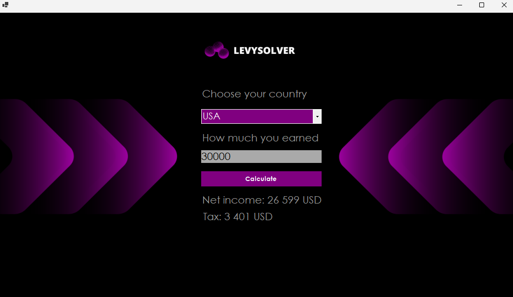
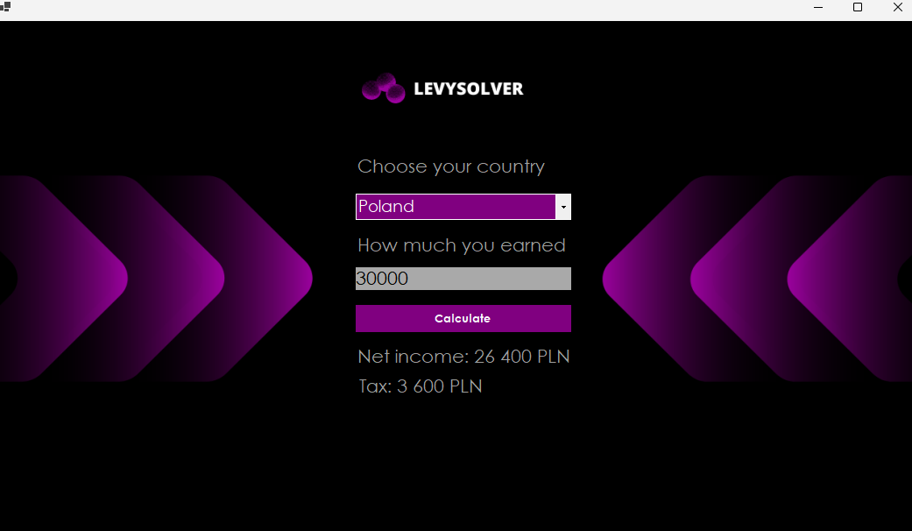

# ENG BELOW
## PRZYKŁADOWE SS

## Opis
Projekt Kalkulator Podatkowy to aplikacja Windows Forms przeznaczona do obliczania podatku i dochodu netto na podstawie rocznego dochodu użytkownika i wybranego kraju. Aplikacja obsługuje wiele krajów, z których każdy ma własne zasady obliczania podatków.

Komponenty:
- FormCalculator.cs: Główna forma, gdzie użytkownicy wprowadzają swoje dochody i wybierają kraj.
- TaxCalculatorBase.cs: Abstrakcyjna klasa bazowa dla różnych kalkulatorów podatkowych specyficznych dla krajów.
- FranceTaxCalculator.cs: Logika obliczania podatków dla Francji.
- GermanyTaxCalculator.cs: Logika obliczania podatków dla Niemiec.
- PolandTaxCalculator.cs: Logika obliczania podatków dla Polski.
- UKTaxCalculator.cs: Logika obliczania podatków dla Wielkiej Brytanii.
- USATaxCalculator.cs: Logika obliczania podatków dla Stanów Zjednoczonych.
- Program.cs: Punkt wejścia aplikacji.

## Szczegółowy Opis
1. FormCalculator.cs
Jest to główna forma, gdzie użytkownicy wchodzą w interakcję z aplikacją.

Pola i Kontrolki:
countryComboBox: Lista rozwijana do wyboru kraju.
incomeTextBox: Pole tekstowe do wprowadzania rocznego dochodu.
calculateButton: Przycisk do uruchamiania obliczeń podatkowych.
taxResultLabel: Etykieta do wyświetlania obliczonego podatku.
netIncomeResultLabel: Etykieta do wyświetlania dochodu netto.

Zdarzenia:
FormCalculator_Load: Inicjalizuje formę.
calculateButton_Click: Obsługuje zdarzenie kliknięcia przycisku obliczeń.

Logika:
Walidacja danych wprowadzonych przez użytkownika.
Instancjonowanie odpowiedniego kalkulatora podatkowego na podstawie wybranego kraju.
Obliczanie podatku i dochodu netto oraz wyświetlanie wyników.

2. TaxCalculatorBase.cs
Ta abstrakcyjna klasa definiuje strukturę dla kalkulatorów podatkowych specyficznych dla krajów.

Metody:
CalculateTax(decimal income): Abstrakcyjna metoda do obliczania podatku na podstawie dochodu.

4. FranceTaxCalculator.cs
Implementuje logikę obliczania podatków specyficzną dla Francji.

Progi Podatkowe:
Dochód do 10 064 €: 0%
10 064 € - 25 659 €: 11%
25 659 € - 73 369 €: 30%
73 369 € - 157 806 €: 41%
Powyżej 157 806 €: 45%
Metoda:
CalculateTax(decimal annualIncome): Oblicza podatek na podstawie francuskich progów podatkowych.

4. GermanyTaxCalculator.cs
Implementuje logikę obliczania podatków specyficzną dla Niemiec.

Progi Podatkowe:
Dochód do 9 984 €: 0%
9 984 € - 58 596 €: 14%
58 596 € - 277 825 €: 42%
Powyżej 277 825 €: 45%

Metoda:
CalculateTax(decimal incomeEur): Oblicza podatek na podstawie niemieckich progów podatkowych.

5. PolandTaxCalculator.cs
Implementuje logikę obliczania podatków specyficzną dla Polski.

Progi Podatkowe:
Dochód do 120 000 PLN: 12%
Powyżej 120 000 PLN: 32%

Metoda:
CalculateTax(decimal income): Oblicza podatek na podstawie polskich progów podatkowych.

6. UKTaxCalculator.cs
Implementuje logikę obliczania podatków specyficzną dla Wielkiej Brytanii.

Progi Podatkowe:
Dochód do £12 570: 0%
£12 570 - £50 270: 20%
£50 270 - £150 000: 40%
Powyżej £150 000: 45%

Metoda:
CalculateTax(decimal income): Oblicza podatek na podstawie brytyjskich progów podatkowych.

7. USATaxCalculator.cs
Implementuje logikę obliczania podatków specyficzną dla Stanów Zjednoczonych.

Progi Podatkowe:
Dochód do $9 950: 10%
$9 950 - $40 525: 12%
$40 525 - $86 375: 22%
$86 375 - $164 925: 24%
$164 925 - $209 425: 32%
$209 425 - $523 600: 35%
Powyżej $523 600: 37%

Metoda:
CalculateTax(decimal annualIncome): Oblicza podatek na podstawie amerykańskich progów podatkowych.

8. Program.cs
Punkt wejścia aplikacji.
Metody:
Main(): Konfiguruje i uruchamia aplikację.

## Użytkowanie
Uruchomienie Aplikacji:
Uruchom plik wykonywalny, aby otworzyć główną formę.

Wybór Kraju:
Wybierz kraj z listy rozwijanej.

Wprowadzenie Dochodu:
Wprowadź roczny dochód w podanym polu tekstowym.

Obliczanie:
Kliknij przycisk "Calculate", aby obliczyć podatek i dochód netto.

Wyniki:
Obliczony podatek i dochód netto są wyświetlane na formie.

Obsługa Błędów

Nieprawidłowy Wybór Kraju:
Wyświetla komunikat, jeśli nie wybrano żadnego kraju.

Nieprawidłowy Dochód:
Wyświetla komunikat, jeśli dochód nie jest poprawną liczbą dziesiętną lub jest mniejszy od 0.

Rozszerzenia
Dodatkowe Kraje:
Nowe kalkulatory podatkowe dla krajów można dodać, tworząc nowe klasy dziedziczące po TaxCalculatorBase i implementujące metodę CalculateTax.

Ulepszenia Interfejsu:
Interfejs użytkownika można ulepszyć dla lepszego doświadczenia użytkownika.

## Jest to projekt przedstawiajacy polimorfizm

##EXAMPLE SCREENSHOTS

Description
The Tax Calculator Project is a Windows Forms application designed to calculate taxes and net income based on the user's annual income and selected country. The application supports multiple countries, each with its own tax calculation rules.

Components:
FormCalculator.cs: The main form where users input their income and select the country.
TaxCalculatorBase.cs: An abstract base class for country-specific tax calculators.
FranceTaxCalculator.cs: Logic for tax calculation specific to France.
GermanyTaxCalculator.cs: Logic for tax calculation specific to Germany.
PolandTaxCalculator.cs: Logic for tax calculation specific to Poland.
UKTaxCalculator.cs: Logic for tax calculation specific to the United Kingdom.
USATaxCalculator.cs: Logic for tax calculation specific to the United States.
Program.cs: The application entry point.
Detailed Description
1. FormCalculator.cs
This is the main form where users interact with the application.

Fields and Controls:

countryComboBox: Dropdown list for selecting the country.
incomeTextBox: Textbox for entering annual income.
calculateButton: Button to trigger the tax calculation.
taxResultLabel: Label to display the calculated tax.
netIncomeResultLabel: Label to display the net income.
Events:

FormCalculator_Load: Initializes the form.
calculateButton_Click: Handles the button click event for tax calculations.
Logic:

Validates user input.
Instantiates the appropriate tax calculator based on the selected country.
Calculates tax and net income, then displays the results.
2. TaxCalculatorBase.cs
This abstract class defines the structure for country-specific tax calculators.

Methods:

CalculateTax(decimal income): Abstract method to calculate tax based on income.
3. FranceTaxCalculator.cs
Implements tax calculation logic specific to France.

Tax Brackets:

Income up to €10,064: 0%
€10,064 - €25,659: 11%
€25,659 - €73,369: 30%
€73,369 - €157,806: 41%
Over €157,806: 45%
Method:

CalculateTax(decimal annualIncome): Calculates tax based on French tax brackets.
4. GermanyTaxCalculator.cs
Implements tax calculation logic specific to Germany.

Tax Brackets:

Income up to €9,984: 0%
€9,984 - €58,596: 14%
€58,596 - €277,825: 42%
Over €277,825: 45%
Method:

CalculateTax(decimal incomeEur): Calculates tax based on German tax brackets.
5. PolandTaxCalculator.cs
Implements tax calculation logic specific to Poland.

Tax Brackets:

Income up to PLN 120,000: 12%
Over PLN 120,000: 32%
Method:

CalculateTax(decimal income): Calculates tax based on Polish tax brackets.
6. UKTaxCalculator.cs
Implements tax calculation logic specific to the United Kingdom.

Tax Brackets:

Income up to £12,570: 0%
£12,570 - £50,270: 20%
£50,270 - £150,000: 40%
Over £150,000: 45%
Method:

CalculateTax(decimal income): Calculates tax based on UK tax brackets.
7. USATaxCalculator.cs
Implements tax calculation logic specific to the United States.

Tax Brackets:

Income up to $9,950: 10%
$9,950 - $40,525: 12%
$40,525 - $86,375: 22%
$86,375 - $164,925: 24%
$164,925 - $209,425: 32%
$209,425 - $523,600: 35%
Over $523,600: 37%
Method:

CalculateTax(decimal annualIncome): Calculates tax based on US tax brackets.
8. Program.cs
The application's entry point.

Method:

Main(): Configures and runs the application.
Usage
Running the Application:

Launch the executable to open the main form.
Country Selection:

Select a country from the dropdown list.
Inputting Income:

Enter the annual income in the provided textbox.
Calculation:

Click the "Calculate" button to calculate the tax and net income.
Results:

The calculated tax and net income will be displayed on the form.
Error Handling
Invalid Country Selection:

Displays a message if no country is selected.
Invalid Income:

Displays a message if the income is not a valid decimal number or is less than 0.
Extensions
Additional Countries:

New tax calculators for other countries can be added by creating new classes that inherit from TaxCalculatorBase and implement the CalculateTax method.
UI Enhancements:

The user interface can be improved to enhance user experience.
##This project demonstrates polymorphism.
